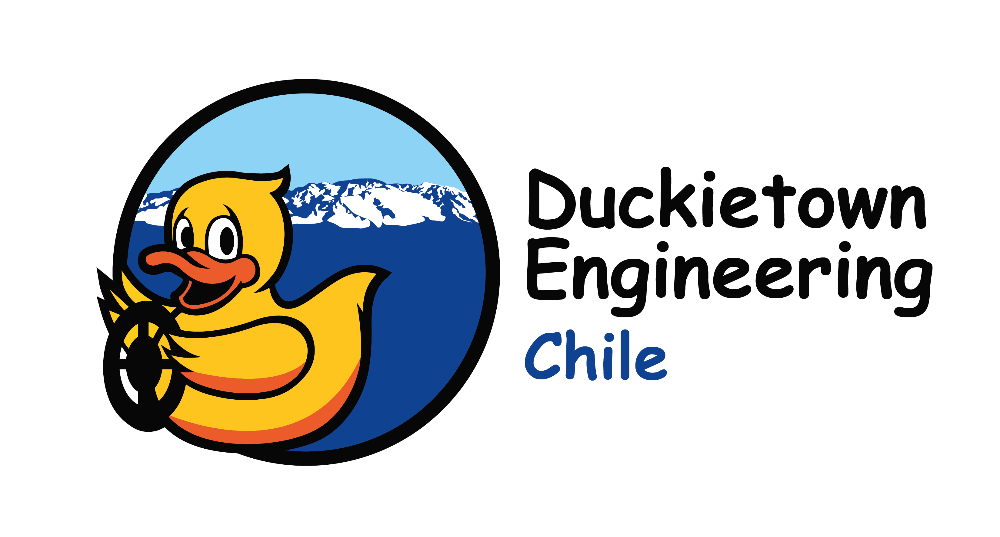

# 
>
>
> # Sistema de Detección de Plagas de Polillas
> 
> 
> ## Contenidos
> - Extras: Archivos no relevantes en gran medida, ejemplo imagen de este documento
>
>  
> ## Sobre el Documento
> - El respiratorio tendrá como principal función ser un medio para operar con git durante el proyecto. 
> - Acá se podrá editar, guardar y visualizar los códigos hechos de una manera más cómoda sin tener que editar el archivo base. 
> - Todos en el equipo tendrán roles para poder usar todas las herramientas del repositorio, si no las tienen, informar para otorgarlas lo antes posible
> 
> 
> ## Algunos Detalles...
> * Cualquier edición importante al git recomiendo hacer un commit para que todo el equipo vea que cambio y asegurar que no se pasó a llevar nada
> * Si no se trabaja en alguna Linux Distro, recomiendo bajar la aplicación de GitHub ([si, existe](https://desktop.github.com)) para poder interactuar más cómodamente.
> * Si se hacen ediciones muy profundas, estaria ideal agregalas y organizarlas en contenidos
>* Si no pescas este documento, no te preocupes, yo tampoco (probablemente se me olvide su existencia jeje).
>
> ## Informacion importante:
> * Hay un google drive para el prpyecto (por ahora), [haz click aqui para acceder a el](https://drive.google.com/drive/folders/18yWxrAzjXtWaV3S-6sPKqmq0Lv7i0GZJ?usp=share_link). Pidanme el acceso si es que se los pide.
> * Google drive que viene a reemplazar a las bitacoras, [accede aqui](https://docs.google.com/spreadsheets/d/1aMeNXYzS-KSaQgExjKFmIQ0Z6rEU8vTEPiiFX3ygAXQ/edit#gid=390953669).
>
> ## To Do List
> - [ ] Agregar si se requiere alguna licensia (ej: MTI)
> - [ ] Mas carpetas cuando se pueda (?, no se, se ve muy vacio)
> - [ ] Organizar, de requerirse, la Wiki
>
